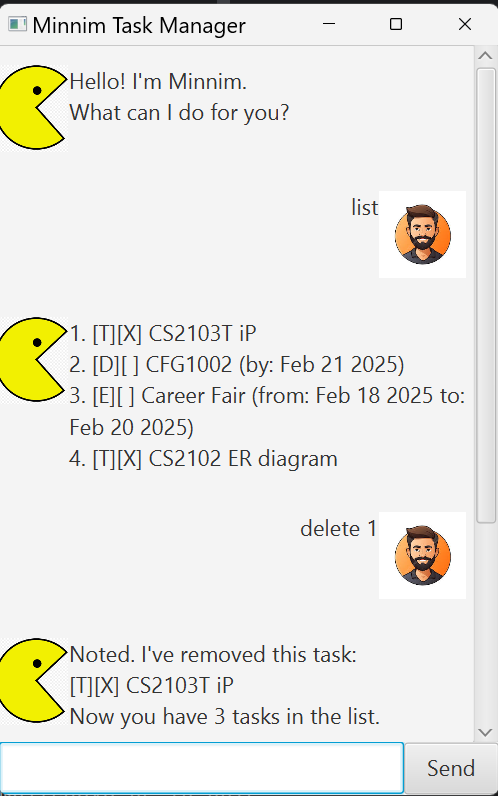
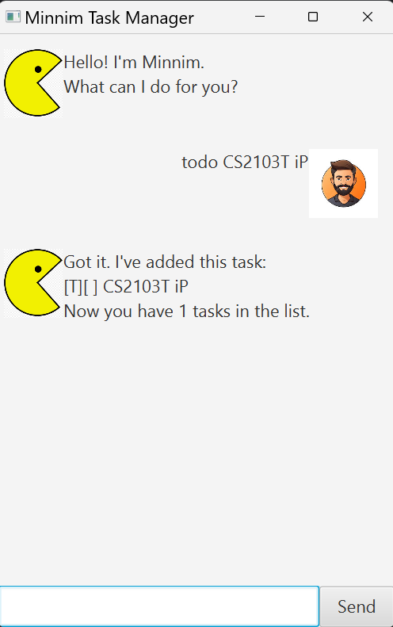
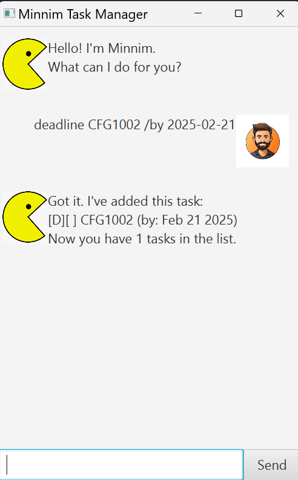
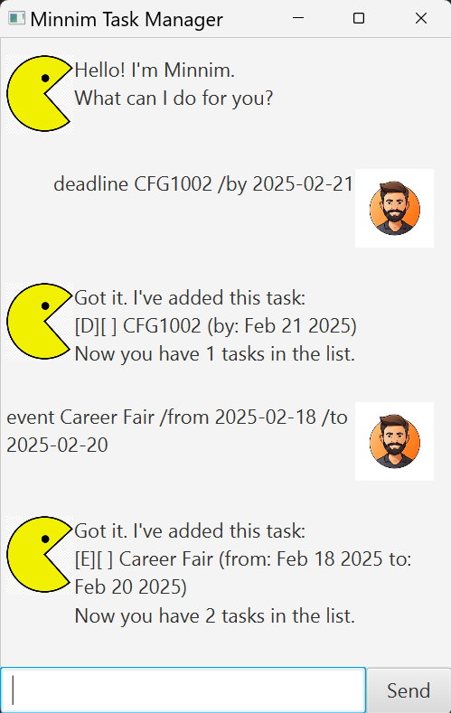
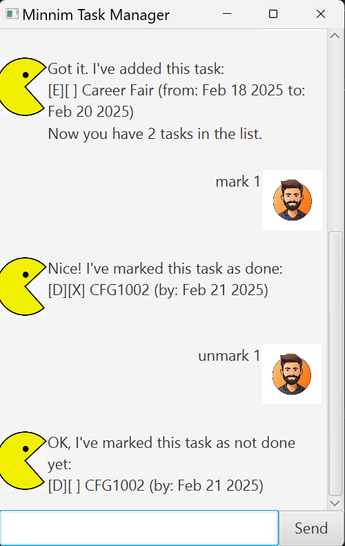
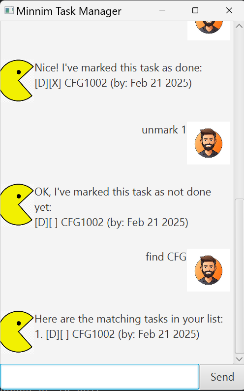
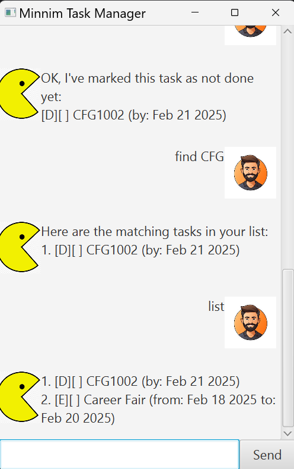
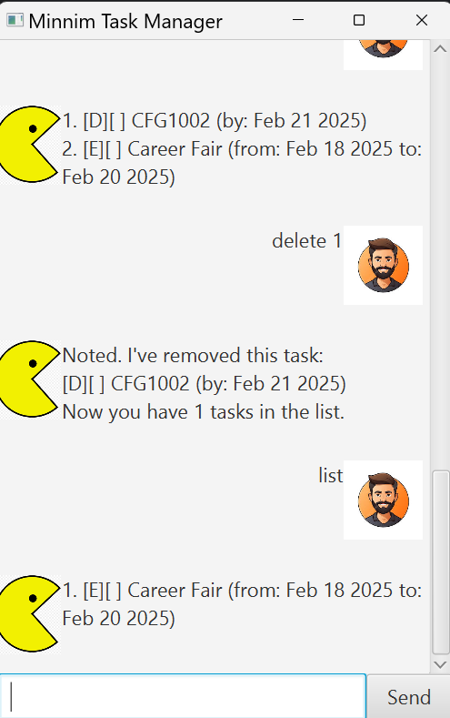
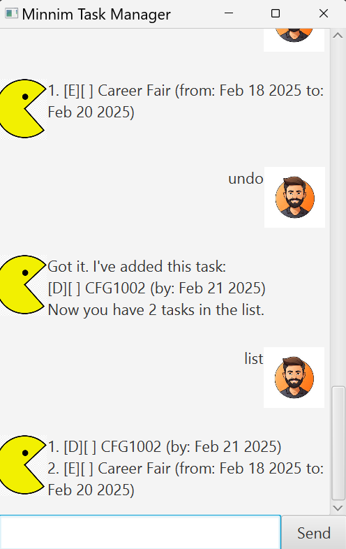

# Minnim User Guide

>“Your mind is for having ideas, not holding them.” – David Allen

Minnim frees your mind of having to remember things you need to do. It's,

- text-based
- easy to learn
- ~~FAST~~ *SUPER FAST* to use

## Supported Features

---
### Add 'Todo' task
You can add your Todo task to the list!

Todo task records detail of the task you need to complete.

Example input: `todo [your task's detail]`

### Add 'Deadline' task
You can add your Deadline task to the list!

Deadline task records detail of the task and deadline you need to complete the task by.

Example input: `deadline [your task's detail] /by [yyyy-MM-dd]`

### Add 'Event' task
You can add your Event to the list!

Event records detail of the event and its start and end date.

Example input: `event [your event's detail] /from [yyyy-MM-dd] /to [yyyy-MM-dd]`

### Mark/unmark tasks
You can set your tasks as marked if completed, and unmark if not completed.

Example input: `mark [task number] / unmark [task number]`

### Find tasks
You can find your task that contains a keyword through the current task list.

Example input: `find [keyword]`

### List tasks
You can get list of your current tasks.

Example input `list`

### Delete task
You can delete your task from current task list.

Example input: `delete [task number]`

### Undo most recent action
You can undo your most recent task. Fix your mistake!

Example input: `undo`

### Bye
Exit your chat with a simple word:

`bye`